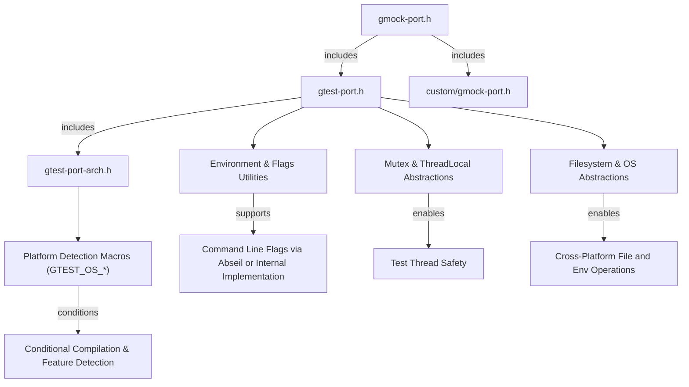

# Portability & Configuration Flags

GoogleTest and GoogleMock rely on a foundational set of configuration headers, macros, platform abstraction APIs, and environment utilities that enable seamless operation across diverse platforms. This documentation guides you through understanding and leveraging these core components to adapt GoogleTest in varied environments and effectively troubleshoot platform-specific challenges.

---

## 1. Overview

GoogleTest’s portability layer serves as the backbone for running tests reliably on various operating systems, compilers, and environments. It encapsulates low-level details such as platform detection, threading support, environment variable handling, and command-line flag integration to present a consistent API surface for test authors.

This page documents:

- Core configuration headers and related macros.
- Platform abstraction utilities supporting filesystem, synchronization, and threading.
- Environment detection and runtime flag mechanisms.


---

## 2. Platform Abstraction & Portability Macros

### 2.1 Environment & Platform Detection

GoogleTest defines and uses a variety of macros to detect and specify platform characteristics. These macros enable conditional compilation and runtime adaptations:

- Platform macros such as `GTEST_OS_WINDOWS`, `GTEST_OS_LINUX`, `GTEST_OS_MAC`, and specialized variants like `GTEST_OS_WINDOWS_DESKTOP`, `GTEST_OS_LINUX_ANDROID`.
- Feature flags indicating support for exceptions (`GTEST_HAS_EXCEPTIONS`), RTTI (`GTEST_HAS_RTTI`), pthreads (`GTEST_HAS_PTHREAD`), POSIX regex (`GTEST_HAS_POSIX_RE`), and death test capability (`GTEST_HAS_DEATH_TEST`).
- Endianness and wide-string encoding detection (e.g., `GTEST_WIDE_STRING_USES_UTF16_`).

These macros are automatically defined during configuration and allow GoogleTest components and users to adapt behavior based on the environment, ensuring reliable execution without manual tweaks in most cases.

### 2.2 Synchronization & Threading Primitives

Thread safety is essential for parallel test execution. GoogleTest provides:

- A `Mutex` class abstracting platform-specific mutexes:
  - Uses native Windows critical sections on Windows platforms.
  - Uses pthread mutexes on POSIX-compliant platforms.
  - Dummy no-op implementation if threading is unsupported.
- `MutexLock` for scoped locking.
- Thread-local storage utilities via the `ThreadLocal<T>` template, ensuring data isolation per thread.
- Conditional compilation accommodates platforms without threading or mutex support, gracefully degrading functionality.


### 2.3 Filesystem & OS Utilities

To operate transparently across OSes, GoogleTest abstracts key filesystem operations:

- File descriptors and handle abstractions such as `FileNo(FILE* file)`.
- Directory operations like `RmDir()` and `IsDir()`.
- File opening and reopening: wrappers like `FOpen`, `FReopen` for gaining compatibility with Windows' wide character APIs.
- Environment variable access via `GetEnv()` adapted to embedded platforms where environment variables may be unavailable.


---

## 3. Configuration Headers and Macros

### 3.1 Core Configuration Headers

- **`gtest-port.h`**: Contains foundational macros, platform detection, feature flags, synchronization and I/O abstractions, environment variable utilities, and command-line flag helpers.
- **`gtest-port-arch.h`**: Platform detection macros that define `GTEST_OS_*` constants, isolated to assist in custom porting configurations.
- **`gmock-port.h`**: Extends `gtest-port.h` to provide GoogleMock-specific portability macros, including support for Abseil flags when enabled.


### 3.2 Command-Line Flags Integration

GoogleTest and GoogleMock support command-line flags for runtime configuration, handled uniformly regardless of the underlying flags library—Abseil or the internal flag implementation:

- Flags are declared and defined via macros like:
  - `GTEST_DEFINE_bool_()`, `GTEST_DEFINE_int32_()`, `GTEST_DEFINE_string_()` for GoogleTest.
  - `GMOCK_DEFINE_bool_()`, `GMOCK_DEFINE_int32_()`, `GMOCK_DEFINE_string_()` for GoogleMock.
- Users reference flags via `GTEST_FLAG(flag_name)` or `GMOCK_FLAG(name)` for GoogleMock flags.
- These flags support environment variable overrides, facilitating integration with CI systems and custom setups.


### 3.3 Environment Variable Utilities

To bridge differences in environment handling:

- Functions like `BoolFromGTestEnv()`, `Int32FromGTestEnv()`, `StringFromGTestEnv()` allow parsing environment variables as typed flag values.
- `GetEnv()` provides platform-aware environment variable retrieval.


---

## 4. Practical Usage and Troubleshooting

### 4.1 Ensuring Portability

- **Verify Platform Macros**: Use `GTEST_OS_*` macros to write portable tests that can adapt behavior or skip tests on unsupported platforms.
- **Check Feature Support**: Use macros like `GTEST_HAS_EXCEPTIONS` or `GTEST_HAS_DEATH_TEST` to conditionally compile code depending on environment capabilities.
- **Synchronize Safely**: Prefer the `Mutex` and `MutexLock` abstractions for any shared data in multi-threaded test environments.


### 4.2 Managing Flags

- Use the documented macros to declare and define flags in testing utilities, respecting Abseil integration if enabled.
- Flags can be set via command line or environment variables for dynamic behavior changes.


### 4.3 Common Pitfalls

- **Threading on Unsupported Platforms**: On platforms lacking pthreads or native threading support, synchronization primitives default to no-ops; tests relying on multi-thread safety may fail
- **Mixing Compilers and MSVC Versions**: GoogleMock requires at least Visual C++ 2015; earlier versions will trigger compile-time errors.
- **Wide String Support**: Some platforms might lack full `std::wstring` support; use the `GTEST_HAS_STD_WSTRING` macro to guard code accordingly.


---

## 5. Example: Defining a Command-Line Flag for GoogleMock

```cpp
#include "gmock/gmock.h"

// Define a boolean flag 'verbose' with default false and documentation.
GMOCK_DEFINE_bool_(verbose, false, "Enable verbose logging for mocks");

int main(int argc, char** argv) {
  ::testing::InitGoogleMock(&argc, argv);

  if (GMOCK_FLAG(verbose)) {
    std::cout << "Verbose mode enabled for mocking" << std::endl;
  }

  // ... rest of test code ...
  return RUN_ALL_TESTS();
}
```

This example demonstrates creating a new runtime-flag, integrated with GoogleMock’s flag system, allowing users to toggle verbose mock output dynamically.


---

## 6. Additional Resources

- [Supported Platforms Guide](https://github.com/google/googletest/blob/main/docs/platforms.md)
- [GoogleTest Build & Integration](https://github.com/google/googletest/blob/main/README.md)
- [GoogleMock Flag Customization](https://github.com/google/googletest/blob/main/googlemock/include/gmock/internal/custom/README.md)
- [Command-Line Flags in GoogleTest & GoogleMock](https://github.com/google/googletest/tree/main/googlemock/include/gmock/internal/gmock-port.h)


---

## 7. Diagram: Platform & Portability Abstractions



---

## 8. Summary

The portability and configuration flags infrastructure within GoogleTest and GoogleMock abstracts platform-specific complexities, providing a consistent developer experience. It enables smooth compilation across platforms, manages environment and CLI flags, and ensures thread-safe operation.

Use these abstractions to write adaptable tests, configure runtime behavior dynamically, and troubleshoot platform-specific issues effectively.


---

## 9. References and Next Steps

- Explore [Setup Essentials](https://github.com/google/googletest/blob/main/docs/getting-started/setup-basics/prerequisites-system-requirements.md) for compiler and environment requirements.
- Review the [Running and Configuring Tests guide](https://github.com/google/googletest/blob/main/docs/guides/core-workflows/running-and-configuring-tests.md) to learn about runtime options leveraging configuration flags.
- Consult [GoogleMock Mock Strictness Helpers](https://github.com/google/googletest/blob/main/docs/api-reference/googlemock-mocking-apis/mock-strictness-helpers.md) for advanced control over mocks via configurable flags.

<Source url="https://github.com/google/googletest" branch="main" paths={[{"path": "googletest/include/gtest/internal/gtest-port.h", "range": "1-350"},{"path": "googlemock/include/gmock/internal/gmock-port.h", "range": "1-100"}]} />