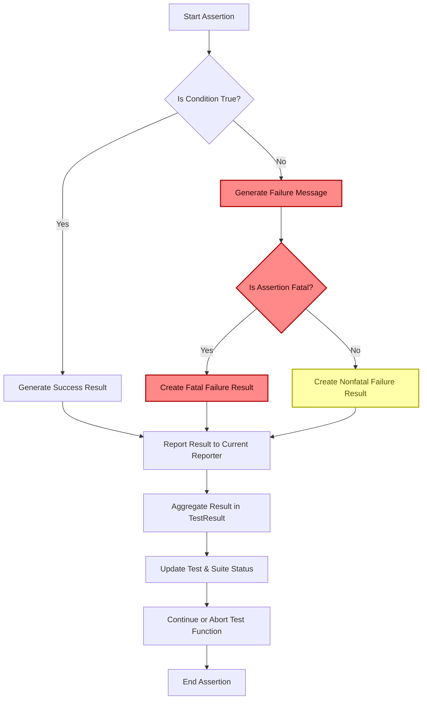

# Assertion Philosophy and Mechanics

Explore how GoogleTest assertions are designed to provide informative diagnostics, safety, and flexibility. Understand fatal vs. non-fatal assertions and how assertion results are reported and aggregated for actionable feedback.

---

## Introduction to GoogleTest Assertions

GoogleTest's assertion system empowers you to verify conditions in your tests precisely and expressively. Rather than merely checking whether a condition is true or false, assertions in GoogleTest provide rich diagnostic output, including messages and stack traces, that help you quickly identify the root cause of test failures.

Assertions are the core building blocks of test verification. They are grouped broadly into two categories:

- **Fatal assertions:** These abort the current function immediately upon failure to prevent further undesired operations.
- **Non-fatal assertions:** These report failure but allow the current function to continue executing, helping you collect more information in a single test run.

The design philosophy behind GoogleTest assertions focuses on clarity, safety, and flexibility to optimize developer productivity.

---

## Informative Diagnostic Feedback

GoogleTest assertions are intended to provide users with detailed failure information beyond a simple true/false result:

- **Expression display:** The source expressions used in the assertion are printed to help identify which condition failed.
- **Value printing:** Values of expressions involved in the assertion are displayed when a failure occurs.
- **Custom failure messages:** Assertions support streaming custom messages with the `<<` operator for added context.
- **Stack traces:** When appropriate, GoogleTest includes stack trace information to pinpoint where the failure was triggered.
- **Scoped traces:** Using the `SCOPED_TRACE` macro, you can add hierarchical context to failures in nested calls.

### Example

```cpp
TEST(ExampleTest, Addition) {
  int a = 2;
  int b = 3;
  EXPECT_EQ(a + b, 6) << "Check sum of a and b";
}
```

If this assertion fails, you will see output including:

```
Value of: a + b
  Actual: 5
Expected: 6
Check sum of a and b
```

Such detailed messaging makes diagnosing test failures straightforward.

---

## Fatal vs. Non-Fatal Assertions

GoogleTest distinguishes between fatal and non-fatal assertion failures to provide control over test execution flow:

- **Fatal Assertions (`ASSERT_*` macros, `FAIL()`):**
  - Immediately abort the current function when they fail.
  - Useful when subsequent code depends on the assertion success.
  - Must appear only in functions returning `void`.

- **Non-Fatal Assertions (`EXPECT_*` macros, `ADD_FAILURE()`):**
  - Record failure but allow execution to continue.
  - Useful when you want to check multiple conditions in a test regardless of individual failures.

### Behavior Summary

| Assertion Type | Failure Effect               | Typical Macros       |
|----------------|-----------------------------|---------------------|
| Fatal          | Abort current function      | `ASSERT_*()`, `FAIL()`|
| Non-Fatal      | Report failure, continue    | `EXPECT_*()`, `ADD_FAILURE()` |


### Practical Use

Use fatal assertions when proceeding after failure could cause crashes or unreliable test behavior. Use non-fatal assertions otherwise, to maximize feedback from a single test run.

---

## Reporting Assertion Results

Assertions are internally represented by `TestPartResult` objects, which encapsulate detailed information about each test part result.

### Key Components of `TestPartResult`

- **Type:** Indicates success, non-fatal failure, fatal failure, or skip.
- **File and Line:** Source location where the assertion occurred.
- **Message:** Failure message including expression details, custom messages, and stack traces.

### How GoogleTest Consumes Assertion Results

- When an assertion is executed, GoogleTest records the `TestPartResult` via the current thread's or global `TestPartResultReporter`.
- These results are aggregated into the `TestResult` for the current test (`TestInfo`).
- The aggregated results for all tests are available through the singleton `UnitTest` instance for reporting and filtering.

This mechanism ensures that each assertion's result is captured and presented clearly.

---

## The `AssertHelper` Role

The internal `AssertHelper` class coordinates the streaming message behavior and reporting for assertions. It is designed around these principles:

- Minimize stack size impact for assertions, as many assertions might be used in one function.
- Provide a convenient interface for streaming failure messages.
- Dispatch assertion results promptly to the current test's result reporter.

### Usage Pattern

When an assertion macro is expanded, it creates an `AssertHelper` temporary object with the failure type, source location, and initial message. You can then use the `<<` operator to append messages. On assignment, it reports the test part result.

---

## Aggregating Results for Actionable Feedback

GoogleTest aggregates assertion results to understand overall test outcomes:

- A test passes only if all assertions within it are successful.
- Non-fatal failures mark the test as failed but allow further assertions.
- Fatal failures abort execution immediately but still record failure clearly.
- Test suite results are computed by aggregating all constituent tests.

### Exposed API for Test Status

`UnitTest` and `TestSuite` provide various counters and status methods such as:

- `successful_test_count()`, `failed_test_count()`, `skipped_test_count()`, and their test suite equivalents.
- `Passed()` and `Failed()` to indicate overall status.
- Access to individual `TestInfo` and `TestResult` objects.

This rich information enables detailed test reporting and supports features like sharding and filtering.

---

## Best Practices and Common Pitfalls

- **Avoid side-effects inside assertions:** Argument expressions should not have side-effects, as they are evaluated exactly once with undefined order.
- **Use fatal assertions for critical checks:** Use `ASSERT_*` when continuing after failure might crash tests.
- **Avoid fatal assertions in constructors and destructors:** Because they only exit the current function, not the entire test, use `SetUp()` and `TearDown()` methods instead.
- **Leverage custom messages and `SCOPED_TRACE`:** Add contextual information to ease failure diagnosis.
- **Use predicate assertions for complex conditions:** Return `AssertionResult` for informative messages on complex checks.

---

## Summary

GoogleTest's assertion mechanism balances informative failure diagnosis, safe test control flow, and flexibility in expressing test expectations. Understanding the difference between fatal and non-fatal assertions, how assertion results are constructed and reported, and how they integrate into the overall test reporting system is key to writing robust and maintainable tests.


---

## Further Reading

- [Assertions Reference](../reference/assertions.md) - Full list of assertion macros and examples.
- [Advanced GoogleTest Topics](../advanced.md) - Detailed concepts including predicate format assertions.
- [Test Discovery & Execution Flow](concepts/core-architecture/test-discovery-execution.md) - Understand how results influence test execution.
- [Using Built-in Matchers](api-reference/matchers-and-advanced-assertions/using-matchers.md) - For richer assertion capabilities.

---

For the essential code and internal implementation of these concepts, see the 
`UnitTestImpl`, `TestResult`, and `AssertHelper` classes in the source files: `gtest.cc`, and `gtest-internal-inl.h`.

---

<AccordionGroup title="Detailed Topics">
<Accordion title="AssertionResult: Success and Failure Representation">
GoogleTest uses the `AssertionResult` class to represent assertion outcomes that go beyond simple booleans. This class encapsulates whether the assertion succeeded, and optionally, a descriptive failure message.

By returning `AssertionResult` from predicate functions, you can provide detailed context upon failure, which GoogleTest surfaces in failure reports for better debugging.
</Accordion>

<Accordion title="Assertion Types and How They Influence Test Flow">
Fatal failures (`kFatalFailure`) interrupt the current function immediately and mark the test as failed. Non-fatal failures (`kNonFatalFailure`) allow continued execution but mark the test as failed.

Understanding this allows you to write tests that either stop on critical failures or gather as much information as possible on softer failures.
</Accordion>

<Accordion title="TestPartResult Reporting Mechanics">
Every assertion generates a `TestPartResult` containing type, location, message, and optionally a stack trace. The current thread's active test part result reporter receives these for aggregation.

Whenever an assertion fails, the framework appends detailed information to the failure message, including user-provided messages and stack traces.
</Accordion>

<Accordion title="Test and TestSuite Result Aggregation">
`TestResult` collects assertion outcomes per test. Tests aggregate these, and test suites aggregate their tests' results, yielding holistic success/failure statuses.

This aggregated information drives reporting, filtering, and the determination of overall test program success.
</Accordion>

<Accordion title="Scoped Trace and Adding Context to Failures">
Use the `SCOPED_TRACE` macro or `ScopedTrace` class to append additional, context-specific trace messages. These traces are automatically included in all assertion failures inside the scope, making diagnosing complex failures easier.
</Accordion>

<Accordion title="Differences Between Assertion Macros (EXPECT_* vs ASSERT_)">
- `EXPECT_*` macros generate non-fatal failures, allowing the function to continue.
- `ASSERT_*` macros generate fatal failures, aborting the current function.

Use `ASSERT_*` when the test should not proceed after a failure (e.g., when invariants are broken).
</Accordion>
</AccordionGroup>

---

## Illustration of Assertion Reporting Flow



This diagram depicts the decision points for each assertion evaluation, how messages are produced, and how results propagate into the aggregated test state.

---

## Troubleshooting Common Issues

- **Fatal assertions in non-void functions:** Since fatal assertions abort the current function, using them in functions returning non-void leads to confusing compiler errors. Use non-fatal assertions or refactor your function.
- **Multiple evaluation of expressions:** GoogleTest evaluates each assertion argument exactly once, but the order is undefined. Avoid side effects in arguments.
- **Assertion in constructor/destructor:** Fatal assertions in constructors or destructors only abort that function, not the whole test. Use `SetUp` and `TearDown` methods instead.
- **Failure messages confusing:** Use custom messages and `SCOPED_TRACE` to add clear context.

---