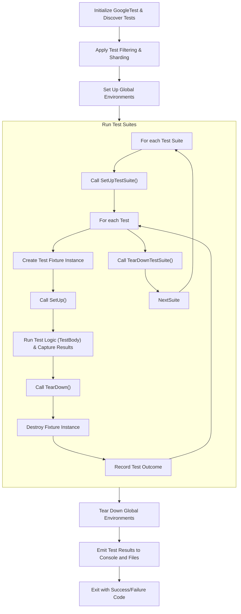

# Test Discovery & Execution Flow

GoogleTest revolutionizes the way C++ tests are located, organized, and executed by automating the entire process from test registration through filtering, execution, and detailed reporting. Understanding this flow empowers you to harness GoogleTest’s powerful features effectively, reduce manual overhead, and write scalable, maintainable tests.

---

## 1. Test Registration: How GoogleTest Recognizes Tests Automatically

### Automatic Test Discovery
GoogleTest automatically detects *all* tests and test suites defined in your program during static initialization, before your tests actually run. This discovery happens through macros like `TEST()`, `TEST_F()`, `TEST_P()`, `TYPED_TEST()`, and others, which internally register test cases with a global singleton.

- **Test Suites** group related test cases. Each test suite is identified by a name and optionally a type parameter for typed tests.
- **Test Info** holds data about an individual test, including:
  - The suite it belongs to
  - The test name
  - Parameter type and value for parameterized tests
  - Source file and line number
  - The test factory method that creates a test instance

### Registration Workflow
When your test binary starts, GoogleTest builds an internal registry:

- For each test suite, an instance is created and stored.
- Each test within a suite is registered with its metadata and a factory to create test instances when the tests run.

This approach eliminates the need for you to manually enumerate tests.

---

## 2. Filtering Tests: Selecting Which Tests to Run

GoogleTest provides users friendly and flexible filtering to run a customized subset of tests:

- The `--gtest_filter` flag or the `GTEST_FILTER` environment variable lets you control which tests execute.
- Filters use a colon-separated list of patterns for inclusion, optionally followed by a minus (`-`) and patterns for exclusion.
- Wildcards supported:
  - `*` matches zero or more arbitrary characters.
  - `?` matches any single character.

**Example:**

```bash
--gtest_filter=FooTest.*-FooTest.Bar
```

Runs all tests in `FooTest` suite except the `Bar` test.

### Internal Filtering Logic
During test run preparation, GoogleTest evaluates each test:

1. Determines if the test is disabled (matching patterns like `DISABLED_*`).
2. Checks if the test matches the positive patterns and does not match any negative patterns.
3. Applies sharding filters if enabled to run only tests assigned to current shard.
4. Flags each test’s run status accordingly.

Disabled tests are skipped unless the `--gtest_also_run_disabled_tests` flag is set.

---

## 3. Running Tests: Lifecycle and Execution

### Individual Test Execution
Each test goes through this lifecycle:

1. **SetUpTestSuite()** (optional): Run once per test suite before its tests.
2. **Test Fixture Construction:** Create a new test fixture instance for the test.
3. **SetUp()** (optional): Prepare test environment for this test.
4. **TestBody():** Run the actual test logic.
5. **TearDown()** (optional): Clean up after the test.
6. **Destruct Fixture:** Destroy the test fixture instance.
7. **Record Results:** Outcomes (pass, fail, skip) are recorded.
8. **TearDownTestSuite()** (optional): Run once after all tests in the suite.

### Test Environment Setup
Global test environments can also be registered via `::testing::AddGlobalTestEnvironment(Environment*)`. These environments allow you to define shared setup and teardown for the entire testing program.

- Their `SetUp()` methods are run before any tests.
- Their `TearDown()` methods run after all tests.

### Handling Skipped / Disabled Tests
- Tests marked as disabled via name prefix `DISABLED_` do not run by default.
- The `GTEST_SKIP()` macro can skip individual test executions at runtime.
- Test skipping and disabled status are reported distinctly.

---

## 4. Test Execution Control Flags

GoogleTest provides an extensive set of command-line flags to control test execution:

| Flag                                  | Purpose                                                  |
|-------------------------------------|----------------------------------------------------------|
| `--gtest_repeat=N`                  | Repeat all tests N times (negative for infinite repeat). |
| `--gtest_fail_fast`                 | Stop running after first test failure.                   |
| `--gtest_shuffle`                   | Randomize the order of test execution.                   |
| `--gtest_random_seed=SEED`          | Specify seed for random test order.                      |
| `--gtest_also_run_disabled_tests`  | Include disabled tests in run.                            |
| `--gtest_list_tests`                | List all tests discovered but do not run.                |
| `--gtest_throw_on_failure`          | Turn assertion failures into C++ exceptions.             |

### Integration of Flags in Run Loop
GoogleTest’s runner evaluates these flags, affecting:

- Whether and in what order tests are run
- How failures influence continuation
- How repeated test iterations behave

---

## 5. Running Parameterized Tests

Parameterized tests increase code coverage by running the same test logic with different input values.

### Registration and Instantiation
- Parameterized test fixtures inherit from `testing::TestWithParam<T>` or implement `WithParamInterface<T>`.
- Tests are defined with `TEST_P()` macro.
- Test parameters are instantiated via `INSTANTIATE_TEST_SUITE_P` using generators:
  - `Values()`, `ValuesIn()`, `Range()`, `Bool()`, `Combine()`, and `ConvertGenerator()`.

### Execution Flow
- At test discovery, GoogleTest collects parameterized tests as templates.
- During initialization, parameterized suites are expanded into individual tests per parameter.
- These expanded tests have distinct names including indexes or custom suffixes.
- Through filtering, users can run selected instances.

---

## 6. Death Tests and Special Test Runners

Death tests verify that code terminates as expected (e.g., crashes on invalid input).

### Execution Characteristics
- Death tests run in a separate process to isolate crashes.
- Test suites named with suffix "DeathTest" run before others.

### Integration into Execution Flow
- Death test child processes are managed transparently.
- GoogleTest suppresses event forwarding in death test subprocesses.
- Flags like `--gtest_death_test_style` control execution mode to balance speed and thread safety.

---

## 7. Test Event Listeners and Reporting

GoogleTest integrates detailed reporting and event notification into the test lifecycle.

### Event Listeners
- `TestEventListener` interface provides hooks before and after:
  - Test program start/end
  - Test suite start/end
  - Test case (test) start/end
  - Assertion results
  - Environment setup/teardown

### Default Listeners
- GoogleTest ships with default console and XML/JSON output listeners.
- Users can customize output by adding or replacing listeners.

### Result Collection
- Test results are gathered in `TestResult` objects for tests, suites, and global context.
- Failures include detailed messages, stack traces, and can be linked to assertions via `TestPartResult`.
- Recorded properties augment reports and appear in output formats.

---

## 8. Summary: Typical Flow Sequence Diagram



---

## Practical Tips & Best Practices

- Always call `::testing::InitGoogleTest(&argc, argv)` before `RUN_ALL_TESTS()` to ensure proper flag parsing and test registration.
- Use meaningful test suite and test names without underscores for easier filtering and reporting.
- When creating parameterized tests, instantiate them explicitly with `INSTANTIATE_TEST_SUITE_P`. Use generators like `Values`, `Range`, and `Combine` to cover parameter spaces efficiently.
- To run disabled tests for debugging, add `--gtest_also_run_disabled_tests` to your command line.
- For death tests, follow the naming convention of ending test suites with `DeathTest` to ensure proper ordering.
- Use event listeners to customize test output or to add integration into CI pipelines and test dashboards.
- Take advantage of the XML (`--gtest_output=xml:path`) or JSON reports for automated tools and CI systems.

---

## Additional Resources

- [GoogleTest Primer](https://github.com/google/googletest/blob/main/docs/primer.md) for fundamentals on writing tests.
- [Advanced Topics](https://github.com/google/googletest/blob/main/docs/advanced.md) for deeper understanding of parameterized and typed tests.
- [Assertions & Expectations Reference](https://github.com/google/googletest/blob/main/docs/reference/assertions.md) for detailed macro usage.
- [Event Listener API](https://github.com/google/googletest/blob/main/docs/advanced.md#extending-googletest-by-handling-test-events) for custom output and reporting.
- [Parameterized & Typed Tests Documentation](https://github.com/google/googletest/blob/main/api-reference/googletest-core-apis/parameterized-typed-tests.md) for comprehensive guides on value and type parameterization.

---

By mastering GoogleTest’s test discovery and execution flow, you reduce manual overhead, avoid common pitfalls, and maximize the productivity and reliability of your C++ testing process.
