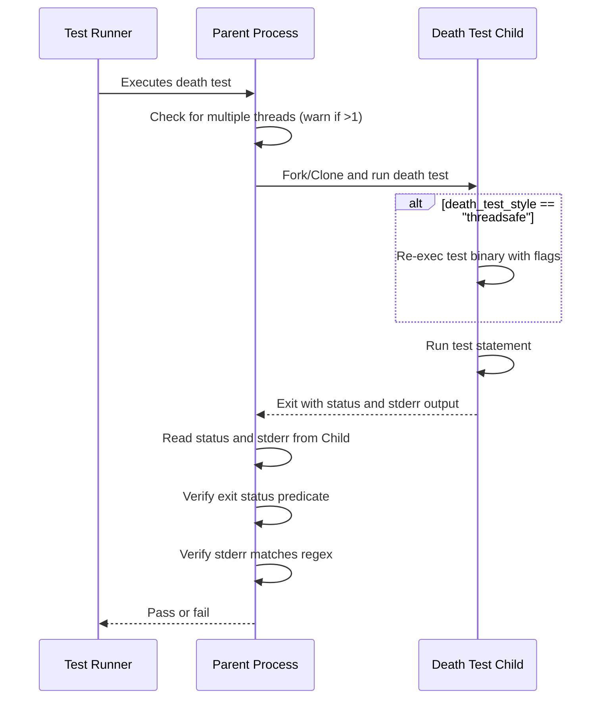

# Writing and Running Death Tests

## Overview

Death tests verify that your code fails or terminates under expected failure conditions, such as triggering assertions or calling `exit()`. This documentation explains how to write death tests using GoogleTest's dedicated macros, configure their behavior for platform compatibility, and avoid common pitfalls to ensure reliable, meaningful test coverage.

---

## 1. Understanding Death Tests

### What Are Death Tests?

Death tests confirm that a block of code causes the program to terminate, either by crashing, calling `exit()`, or otherwise abnormal termination. Such tests are crucial for validating asserts, precondition checks, or error handling that must fail fast to prevent undefined behavior.

### When to Use Death Tests

- To verify that invalid input or illegal states cause your program to abort safely.
- To assert that critical invariants trigger program termination in failure scenarios.
- To test error paths that emit diagnostic messages before termination.

> **Note:** Death tests do not cover exceptions since those do not terminate the process and can be caught. Use exception assertions for those cases.

---

## 2. Prerequisites

Before writing death tests, ensure:

- Your project includes GoogleTest headers and links with the GoogleTest library.
- Tests that use death macros reside within `TEST()`, `TEST_F()`, or fixture methods.
- You have configured your test binary to be invocable via a path containing a directory separator (especially important on POSIX for "threadsafe" style).
- (Optional) You understand your platform's threading model and any implications on the test binary.

---

## 3. Death Test Macros

GoogleTest provides several macros to write death tests. All execute the tested statement in a subprocess to isolate failure.

| Macro                 | Behavior                                  | Continues on Failure |
|-----------------------|-------------------------------------------|----------------------|
| `ASSERT_DEATH(stmt, matcher)`  | Asserts that `stmt` causes termination with stderr matching `matcher`. Fails fatally on failure. | No                   |
| `EXPECT_DEATH(stmt, matcher)`  | Same as above but reports nonfatal failure so test continues. | Yes                  |
| `ASSERT_EXIT(stmt, predicate, matcher)` | Asserts `stmt` terminates with an exit status satisfying `predicate` and stderr matching `matcher`. | No                   |
| `EXPECT_EXIT(stmt, predicate, matcher)` | Same as above but with nonfatal failure. | Yes                  |
| `EXPECT_DEBUG_DEATH(stmt, matcher)` | Behaves like `EXPECT_DEATH` in debug builds; runs normally otherwise. | Yes                  |
| `ASSERT_DEBUG_DEATH(stmt, matcher)` | Behaves like `ASSERT_DEATH` in debug builds; runs normally otherwise. | No                   |
| `EXPECT_DEATH_IF_SUPPORTED(stmt, matcher)` | Runs death test if death testing is supported, else ignores. | Yes                  |
| `ASSERT_DEATH_IF_SUPPORTED(stmt, matcher)` | Runs death test if supported, else ignores. | No                   |

### Basic Usage Example

```cpp
TEST(MyDeathTest, DiesOnInvalidInput) {
  ASSERT_DEATH({ ValidatePort(-1); }, "Invalid port number");
}

TEST(MyDeathTest, ExitWithZero) {
  EXPECT_EXIT(ExitNow(), ::testing::ExitedWithCode(0), "Exiting");
}
```

Here the first test checks that `ValidatePort(-1)` causes death with a message matching `Invalid port number`. The second verifies that `ExitNow()` terminates with exit code zero and outputs `Exiting`.

---

## 4. Configuring Death Test Behavior

### Death Test Styles

GoogleTest supports two death test styles, chosen via the flag `--gtest_death_test_style` or programmatically with:

```cpp
GTEST_FLAG_SET(death_test_style, "fast");  // default
// or
GTEST_FLAG_SET(death_test_style, "threadsafe");
```

| Style      | Description                                                                                                   |
|------------|---------------------------------------------------------------------------------------------------------------|
| `fast`     | Forks child process and runs death test statement immediately. Faster, but unsafe in multi-threaded programs. |
| `threadsafe` | Child process re-executes test binary to run the death test in isolation. More robust with threads but slower. |

The default style is `fast`, which is fine for single-threaded tests. In complex multi-threaded setups where other threads are running, prefer `threadsafe`.

### Platform Notes

- On Windows and Fuchsia, death tests are always thread-safe; the `fast` style is treated as `threadsafe`.
- On POSIX, your test binary must be launched via a path containing a directory separator for `threadsafe`.
- Use the flag `--gtest_death_test_use_fork` if your environment (like Valgrind) does not support `clone()` properly.

### Setting Flags

Flags can be set on the command line when running tests:

```bash
./foo_test --gtest_death_test_style=threadsafe
```

or inside `main()` before calling `RUN_ALL_TESTS()`:

```cpp
int main(int argc, char** argv) {
  testing::InitGoogleTest(&argc, argv);
  GTEST_FLAG_SET(death_test_style, "threadsafe");
  return RUN_ALL_TESTS();
}
```

---

## 5. Writing Effective Death Tests

### Crafting the Death-Tested Statement

- The statement can be any valid C++ statement or compound statement (block).
- Avoid returning from or throwing exceptions inside the tested `statement`. This is reported as failure.
- Avoid using GoogleTest assertions that return early (like `ASSERT_*`) inside `statement` as they may cause unexpected behavior.
- Side effects in the death test are confined to the child process and will not be observed by the parent. Do not rely on side effects to validate behavior.

### Matching the Error Output

- The `matcher` parameter verifies the stderr output from the child process.
- It can be either a [GoogleTest matcher](https://github.com/google/googletest/blob/main/docs/reference/matchers.md) or a simple regex string.
- On POSIX, the regex uses POSIX extended syntax; on Windows, a simpler subset is supported:

  - Supported constructs include literal characters, `\d`, `\w`, `.`, `*`, `+`, `?`, `^`, `$`.
  - Unsupported constructs include grouping `( )`, union `x|y`, brackets `[ ]`, and repetitions like `{}`.

- Avoid unsupported regex features to prevent run-time failures.

### Verifying Exit Status with `EXPECT_EXIT`/`ASSERT_EXIT`

- The `predicate` is a callable taking an `int` exit status and returning `bool`.
- GoogleTest provides two useful predicates:

```cpp
::testing::ExitedWithCode(int expected_code);
// Verifies the process exited normally with the given code.

::testing::KilledBySignal(int signal_number);
// Verifies the process was killed by a signal (not supported on Windows).
```

Example:

```cpp
EXPECT_EXIT(NormalExit(), testing::ExitedWithCode(0), "Success");
EXPECT_EXIT(RaiseSigkill(), testing::KilledBySignal(SIGKILL), "signal caught");
```

### Streaming Additional Messages

You can append messages to failure reports:

```cpp
EXPECT_DEATH(Foo(), "Error") << "Failure testing Foo()";
```

---

## 6. Best Practices and Common Pitfalls

### Naming Death Test Suites

- Name your test suites containing death tests with the suffix `DeathTest`.
- GoogleTest runs these suites before others to minimize threading risks.

### Handling Mocks in Death Tests

- If using mocks with death tests expecting specific exit codes, allow mocks to leak with `Mock::AllowLeak()` to avoid false-positive leak detection.

### Single-thread Safety

- Death tests warn when multiple threads are running as `fork()` is unsafe on multi-threaded processes.
- For multi-threaded tests, prefer the `threadsafe` style.

### Avoid Multiple Death Assertions on Same Line

- Placing multiple death test assertions on the same source line causes compilation failures.

### Side Effects Limitations

- Side effects in death tests are invisible to the parent process.
- Avoid releasing resources in death tests unless cleaned up outside.

### Handling Exceptions

- Death tests fail if the tested statement throws; guard against exceptions to maintain clarity.

---

## 7. Troubleshooting

| Issue                                           | Solution                                                             |
|-------------------------------------------------|----------------------------------------------------------------------|
| Death test silently passes or fails unexpectedly | Ensure the statement actually calls `exit()`, crashes, or aborts.   |
| Regex mismatch errors                            | Simplify your regex to supported POSIX/simple subset.                |
| Multiple threads warning in POSIX                | Switch to `threadsafe` death test style or refactor to single-thread.|
| Regex pattern has unsupported constructs         | Remove groups `()`, unions `|`, repetition `{}`, brackets `[]`.      |
| Cannot find test binary when using `threadsafe`  | Invoke test binary via a relative or absolute path containing `/`.   |
| Side effects not noticed after death test        | Remember death test runs in a subprocess; side effects are not visible.|
| Compilation errors on multiple death asserts same line | Put each death test macro on its own line.                        |

---

## 8. Advanced Usage Examples

### Death Test with Compound Statement

```cpp
TEST(MyDeathTest, CompoundStatement) {
  ASSERT_DEATH({ 
    int x = -1;
    ValidatePort(x);
  }, "Invalid port number");
}
```

### Looping Death Tests

```cpp
for (int i = 0; i < 5; ++i) {
  EXPECT_DEATH(ProcessRequest(i), "Invalid request")
      << "Failed on iteration " << i;
}
```

### Using Predicates with EXPECT_EXIT

```cpp
bool KilledBySIGHUP(int status) {
  return WIFSIGNALED(status) && WTERMSIG(status) == SIGHUP;
}

EXPECT_EXIT(TriggerHangUp(), KilledBySIGHUP, "Hang up signal received");
```

### Debug Mode Death Test

```cpp
EXPECT_DEBUG_DEATH({ 
  LOG(DFATAL) << "Fatal debug log"; 
  SomeFunction();
}, "Fatal debug log");
```

### Using Custom Matchers as Error Matchers

```cpp
EXPECT_DEATH(DoSomething(), testing::ContainsRegex("error.*critical"));
```

---

## 9. Summary

Death tests are a critical tool to verify robust failure and termination behavior in your code. Using GoogleTest's dedicated macros alongside careful regex and predicate matching ensures your tests validate abortive conditions correctly while isolating each test safely in a subprocess.

---

## 10. References and Next Steps

- [GoogleTest Assertions Reference](../reference/assertions.md#death)
- [Advanced GoogleTest Topics: Death Tests](../advanced.md#death-tests)
- [GoogleTest Primer](../primer.md)
- [Writing and Running Parameterized Tests](parameterized-tests-guide.md)
- [Matchers Reference](../matchers.md)
- [GoogleTest GitHub Repository](https://github.com/google/googletest)
- [GoogleTest FAQ: Diagnosing Common Test Failures](../../faq/basics-and-troubleshooting/common-test-failures.md)

---

## Appendix: Death Test Workflow Diagram


