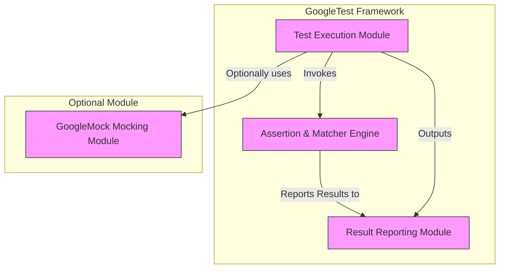

# System Architecture Diagram

This section presents a high-level architecture diagram of GoogleTest, illustrating its key modules and their interactions. The diagram highlights how components responsible for test execution, assertion and matcher engines, result reporting, and optional mocking are integrated both horizontally and vertically. This visualization is designed to help users grasp the overall structure and flow within GoogleTest's core framework.

## Overview

The GoogleTest framework is composed of distinct yet interrelated modules that collaborate to provide a robust and extensible testing platform. These modules enable effective test discovery, execution, verification via assertions and matchers, and comprehensive result reporting. Additionally, GoogleMock integrates seamlessly as an optional module to handle mocking requirements.

The architecture ensures modularity, allowing users to leverage core testing functionalities with or without mocking, and to understand the flow from test registration to final result output.

## Architecture Diagram

## Key Components Explained

### Test Execution Module
- **Purpose:** Orchestrates the discovery and execution of test cases.
- **Responsibilities:** Initializes the test environment, runs registered tests, and manages test lifecycles.
- **Benefit:** Provides a consistent and efficient platform for running tests across diverse C++ codebases.

### Assertion & Matcher Engine
- **Purpose:** Validates test expectations by comparing actual outcomes against expected results.
- **Responsibilities:** Implements a rich set of assertion macros and matcher semantics for expressive test conditions.
- **Benefit:** Enables precise validation of code behavior, supporting clear reporting of assertion failures.

### Result Reporting Module
- **Purpose:** Collects and formats test execution results.
- **Responsibilities:** Aggregates test results, logs failures and successes, and interfaces with various output formats.
- **Benefit:** Delivers insightful feedback to developers, facilitating rapid identification and resolution of issues.

### GoogleMock Mocking Module (Optional)
- **Purpose:** Supports creating and using mock objects within tests.
- **Responsibilities:** Provides syntax for defining mocks, setting expectations, and verifying interactions.
- **Benefit:** Allows detailed control over dependencies, enabling comprehensive interaction-based testing.

## How Modules Interact

- Tests are registered and managed by the **Test Execution Module**.
- When tests execute, they leverage the **Assertion & Matcher Engine** to verify conditions.
- Results from assertions are sent to the **Result Reporting Module** for aggregation and display.
- If mocking is enabled, the **GoogleMock Module** integrates with the test execution process to create mock objects and monitor interactions.

This setup allows each module to specialize in a core concern while working together to deliver a coherent testing experience.

## Practical Use Case

Imagine running a suite of unit tests for a complex C++ project:

1. The **Test Execution Module** discovers all test cases in your code.
2. Each test runs and internally uses assertion macros evaluated by the **Assertion Engine**.
3. Any failures are reported immediately and logged by the **Result Reporting Module**.
4. If your test uses mocks, those are managed and verified by the **GoogleMock Module** seamlessly.

This flow ensures your code is tested correctly, with clear and actionable feedback for rapid development cycles.

## Tips & Best Practices

- **Leverage mocking only when necessary:** Keep tests simple by using mocks only when external dependencies must be simulated.
- **Focus assertions on behavior:** Use the assertion engine to validate expected outcomes clearly and succinctly.
- **Monitor test output:** The result reporting module's feedback is vital for ensuring test reliability and diagnosing issues.

## Troubleshooting Common Issues

- **Unexpected test failures:** Verify if assertions are correctly specified and mocks behave as intended.
- **Mocking integration problems:** Confirm the GoogleMock module is initialized properly when used.
- **Result reporting gaps:** Ensure test results are routed properly to the reporting module and output channels.

For detailed troubleshooting, refer to [Mocking FAQ](https://google.github.io/googletest/gmock_faq.html) and the [Assertions & Expectations guide](https://google.github.io/googletest/reference/testing.html).

---

For a deeper dive into each component, see the [Design Overview & Architecture](./design-overview-architecture.html) and [Core Concepts & Terminology](./core-concepts-terminology.html) pages.

---