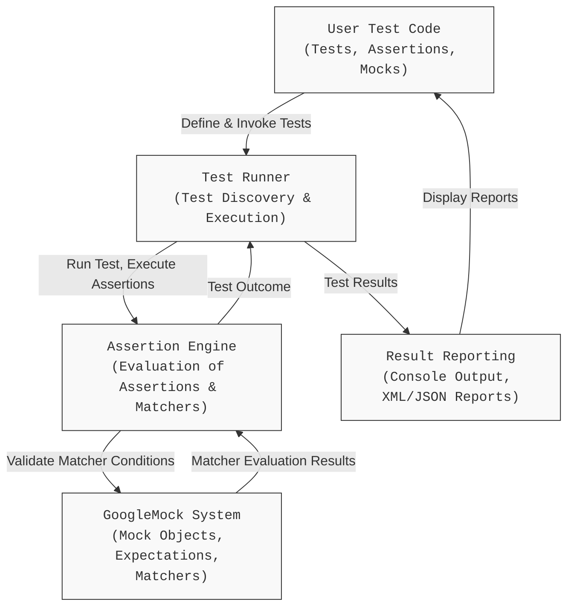

# Design Overview & Architecture

GoogleTest is a powerful C++ testing framework that provides a robust infrastructure to write, run, and manage tests effectively. This page offers a comprehensive visualization of its core components and the interactions between them, giving you a big-picture understanding of how GoogleTest integrates into your C++ build process.

---

## Understanding the Design

At its essence, GoogleTest offers a structured way to write tests, verify assertions, and report results—all integrated smoothly into your development workflow. Its architecture reflects the key user goals:

- ***Write tests efficiently:*** With macros and fixtures that reduce boilerplate.
- ***Validate conditions intuitively:*** Via rich assertions and matchers.
- ***Run tests systematically:*** Managing execution, filtering, and ordering.
- ***Report results clearly:*** Offering detailed failure messages and test summaries.

To achieve this, GoogleTest bundles multiple components that cooperate to support these goals.

---

## Main Components and Their Roles

### 1. Test Code

This is the user-written C++ test code:

- **Test Suites and Cases:** Defined by `TEST()` and `TEST_F()` macros.
- **Assertions and Expectations:** Using GoogleTest macros like `EXPECT_EQ`, `ASSERT_TRUE`, and integration with GoogleMock for mocking behavior.

### 2. Test Runner

The core logic responsible for executing your tests:

- Discovers and registers all test cases.
- Runs each test in isolation.
- Handles setup and teardown of fixtures.
- Collects and aggregates test results.

### 3. Assertion Engine

The subsystem that evaluates your test assertions:

- Interprets assertion macros.
- Distinguishes fatal vs non-fatal failures.
- Generates descriptive failure messages.
- Supports rich predicates, including those using GoogleMock matchers.

### 4. Matchers and Mocking System (GoogleMock)

An optional but powerful extension for interaction testing:

- Enables creation of mock objects corresponding to your interfaces.
- Facilitates setting expectations on calls, specifying arguments, and controlling behavior.
- Integrates seamlessly with assertions using `EXPECT_CALL()` and the matcher syntax.

### 5. Result Reporting

Collects test outcomes and displays or formats them:

- Provides console output with color-coded pass/fail statuses.
- Optionally generates XML or JSON test reports for CI integration.
- Includes detailed diagnostics on failed tests for rapid debugging.

---

## Interaction Flow: From Test Code to Reporting

This user-centric view shows how these components operate together when you run your tests.

This flow illustrates:

- Your test code defines and drives tests.
- The test runner manages the lifecycle and ordering of test execution.
- Each assertion is evaluated by the assertion engine, which consults GoogleMock matchers if used.
- Test results flow back through the runner.
- Finally, the reporting component logs outcomes for the developer.

---

## Integration Within Your Build

GoogleTest is designed to integrate naturally with your existing C++ build systems:

- **Header-Only & Source Files:** GoogleTest and GoogleMock come as source code with headers, compiled alongside your tests.
- **Test Binaries:** User test code is compiled and linked together with GoogleTest libraries.
- **No Runtime Dependencies:** The framework requires no special runtime apart from standard C++ library support.

This allows seamless building and testing across Linux, Windows, and macOS.

---

## Why This Architecture Matters To You

- **Extensibility:** The modular design lets you use only what you need — from lightweight assertions to full-featured mocking.
- **Performance:** Tests run independently and cleanly, which reduces flaky results and improves feedback speed.
- **Reliability:** Detailed assertions and integration with GoogleMock allow you to catch bugs early and write expressive tests.
- **Maintainability:** A clear flow and separation of concerns mean your test code remains clean, organized, and easy to debug.

---

## Practical Tips

- Use `TEST()` and `TEST_F()` macros to organize your tests around test suites and fixtures.
- Employ the rich assertions to gain detailed failure information.
- Leverage GoogleMock to isolate dependencies and test interactions precisely.
- Review reporting outputs to quickly identify failure reasons and locations.

---

## Next Steps

- To start writing tests, see our [Writing Your First GoogleTest](/guides/core-workflows/writing-first-test) guide.
- To understand the underlying test architecture, also check [Core Concepts & Terminology](/overview/architecture-concepts/core-concepts-terminology).
- Visit [Features at a Glance](/overview/architecture-concepts/feature-overview) for a quick summary of capabilities.

---

## Source Reference

For a deep dive into the code serving these components, visit the GitHub repository: 

[GoogleTest GitHub Repository](https://github.com/google/googletest)

---