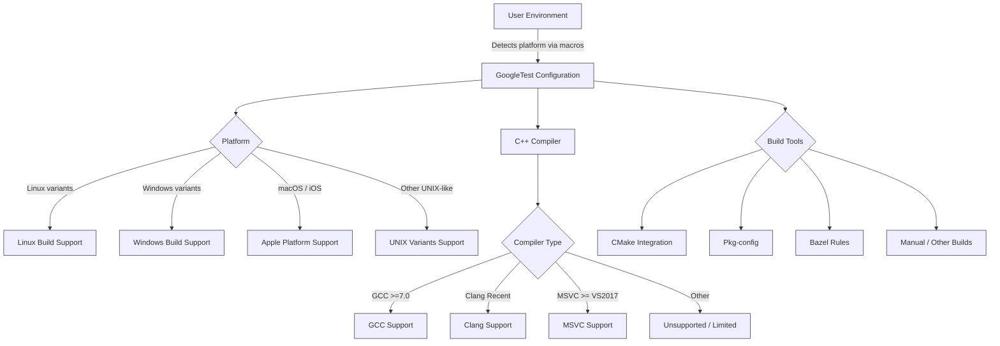

# Supported Platforms & Requirements

GoogleTest adheres strictly to Google's [Foundational C++ Support Policy](https://opensource.google/documentation/policies/cplusplus-support), ensuring compatibility and reliability across a variety of platforms, compilers, and build tools.

This page serves as your guide to understanding the supported environments where GoogleTest can be seamlessly built and run. It explains which versions of operating systems and C++ compilers GoogleTest supports, as well as guidance on compatibility with various build tools.

---

## Why Platform and Compiler Support Matters

When you choose GoogleTest as your C++ testing framework, compatibility is crucial. Your test suites should compile and run consistently across your development, staging, and production environments. GoogleTest's commitment to broad platform support means you can write tests once and expect them to work everywhere, greatly reducing integration headaches and build inconsistencies.

However, understanding the exact platforms, compilers, and build tools supported helps you avoid surprises and plan your development workflow accordingly.

---

## Supported Platforms Summary

GoogleTest currently supports a wide range of operating systems, including but not limited to:

- **Linux:** Popular distributions with GCC, Clang, or Intel compilers
- **Windows:** Including desktop environments and MinGW
- **macOS and iOS:** Apple platforms with Clang-based toolchains
- **UNIX variants:** Such as FreeBSD, Solaris, AIX, and NetBSD
- **Embedded and others:** Some support exists but with limitations

For a detailed list and specific version requirements, consult the [Foundational C++ Support matrix](https://github.com/google/oss-policies-info/blob/main/foundational-cxx-support-matrix.md).

GoogleTest automatically detects platform macros internally (e.g., `GTEST_OS_LINUX`, `GTEST_OS_WINDOWS`) to tailor its builds to your environment.

---

## Supported Compilers and C++ Standards

GoogleTest requires an environment capable of compiling with **C++17** standard features. Supported compilers include:

- **GCC:** Version 7.0 and later, where GoogleTest's warnings and features align with compiler capabilities
- **Clang:** Supported through recent major versions, with extra support for strict warnings
- **MSVC:** Visual Studio 2017 Update 3 (VS 15.7) and newer
- **Intel C++ Compiler:** Compatible Intel compilers targeting modern C++

Because GoogleTest leverages modern C++17 features, older compilers or non-conforming implementations are not supported.

---

## Build Tools and Integration

GoogleTest supports multiple build tools and methods to integrate the framework into your project:

- **CMake:** The primary supported build system; GoogleTest provides a versatile `CMakeLists.txt` enabling standalone builds or integration into existing projects.
- **Pkg-config:** `.pc` files are provided to discover compilation and linking flags easily across build systems.
- **Bazel:** Native Bazel rules exist for building GoogleTest.
- **Manual Makefiles or other build systems:** Supported by manually pointing to headers and sources, though heavier integration requires using either CMake or Bazel.

GoogleTest’s build scripts also include mechanisms for adjusting compiler flags for strict warnings, threading support detection, and shared vs static library builds.

---

## Compatibility Notes and Ongoing Support Policies

- GoogleTest is continuously maintained to track and adapt to changes in compilers and platforms covered by Google’s C++ Support Policy.
- Deprecated or legacy systems may lose support over time to prioritize maintainability and modern C++ usage.
- Pthread support is automatically detected and enabled on platforms where available to ensure thread-safe test execution.
- On Windows, various flavors (native, MinGW) are supported with the appropriate threading and build tool nuances.

---

## Practical Tips for Ensuring Platform Compatibility

- Always build with a compiler that fully supports C++17. Use the GoogleTest CMake option `-DCMAKE_CXX_STANDARD=17` to enforce this.
- Check for your platform's entry in the [Foundational C++ Support matrix](https://github.com/google/oss-policies-info/blob/main/foundational-cxx-support-matrix.md) to verify supported compiler versions.
- Use the provided `pkg-config` or CMake integration to pick the right include and linker flags, particularly for pthread and threading support.
- When cross-compiling or deploying to embedded platforms, consider the sysroot and proper pkg-config environment settings as detailed in the build documentation.
- If your environment lacks pthreads or exceptional threading support, you can disable threading support cautiously but at the risk of non-threadsafe tests.

---

## Troubleshooting & Common Issues

<Tip>
If a build fails due to missing pthread symbols or threading macros, verify that your compiler and platform support POSIX threads or define `-DGTEST_HAS_PTHREAD=0` explicitly if threading is unsupported.

For Windows builds, enabling `-Dgtest_force_shared_crt=ON` in CMake aligns runtime linkage with other components, avoiding linker conflicts.
</Tip>

<Warning>
Building on unsupported or untested platforms may result in compilation errors or runtime issues. Always refer to the compatibility matrix and GoogleTest release notes before attempting.
</Warning>

---

## Further Reading and Resources

- [GoogleTest Primer](../docs/primer.md): Learn how to write tests that run reliably across platforms.
- [CMake Build Instructions](../googletest/README.md#build-with-cmake): Step-by-step guide to building with CMake on various platforms.
- [Pkg-config Integration Details](../docs/pkgconfig.md): How to use pkg-config files for seamless build system integration.
- [Internal Portability Macros](../googletest/include/gtest/internal/gtest-port.h): Understand how GoogleTest distinguishes platforms and features internally.
- [Foundational C++ Support Policy](https://opensource.google/documentation/policies/cplusplus-support): Google's guidelines for C++ compiler and platform support.

---

## Summary

This page positioned within the **Getting Started & Ecosystem Integration** section focuses solely on the platforms, compilers, and build environments supported by GoogleTest. It complements introductory pages on what GoogleTest is, its architecture, and how to write and run tests by grounding your setup in a compatible environment.

For practical development, ensure that your chosen toolchain aligns with these compatibility guidelines, which guarantee the smoothest experience when using GoogleTest.

---

# Diagram: Platform Detection and Build Tool Integration Overview

---

## Next Steps

To proceed, please visit the following related documentation:

- **Installation Guide (Linux, macOS, Windows)**: How to get GoogleTest installed on your supported platform.
- **Basic Configuration & Integration**: Steps to integrate GoogleTest into your existing build system.
- **Writing and Building Your First Test**: Start writing tests on your configured platform.

These will build on your understanding of supported platforms and help you get started quickly and effectively.

---

This documentation empowers you to confidently set up GoogleTest, knowing the scope and limits of its platform support, guaranteeing a stable and productive testing environment.
