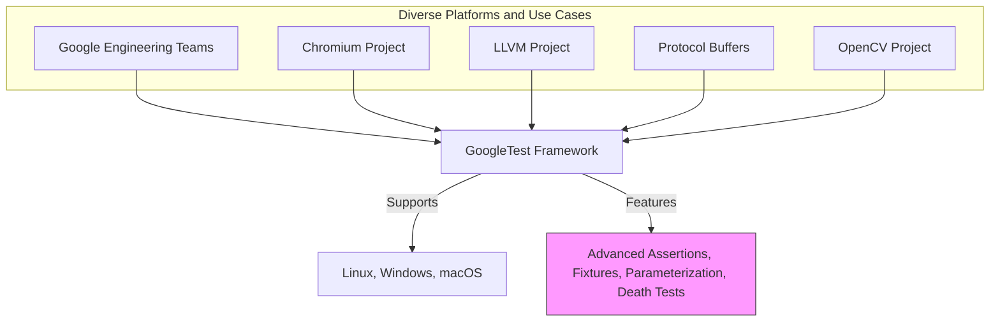

# Who Uses GoogleTest?

Discover how GoogleTest serves teams at Google and prominent open source projects such as Chromium, LLVM, Protocol Buffers, and OpenCV. Learn from real-world usage to see the framework’s scalability and reliability.

---

## Introduction

GoogleTest is not just a testing framework restricted to internal use at Google—it powers critical testing infrastructure for a wide range of large-scale projects both within Google and in the broader open source community. This page shines a light on who uses GoogleTest and why it is trusted to deliver scalable, reliable testing in complex development environments.

## Real-World Users of GoogleTest

### Google Engineering Teams

GoogleTest was originally developed by Google's Testing Technology team to address unique challenges in testing Google’s vast C++ codebases. It supports multiple platforms and compiler configurations, aligning perfectly with Google’s diversity of environments. Teams across Google rely on GoogleTest for:

- **Robust Test Isolation:** Enabling independent and repeatable test execution,
- **Scalable Test Suites:** Managing thousands of tests across multiple projects and teams,
- **Fast Feedback:** Helping development cycles move swiftly with rich failure diagnostics,
- **Seamless Integration:** Working within automated build and continuous integration systems.

### Key Open Source Projects Using GoogleTest

GoogleTest’s impact extends well beyond Google’s walls. Its scalable design and robust features make it the testing framework of choice for many influential open source C++ projects:

- **Chromium:** The open-source project behind the Chrome browser uses GoogleTest extensively to ensure browser reliability and security.
- **LLVM:** This compiler infrastructure project employs GoogleTest to validate compiler behaviors across architectures.
- **Protocol Buffers:** Google's serialization format uses GoogleTest to maintain correctness and performance guarantees.
- **OpenCV:** The popular computer vision library relies on GoogleTest to maintain the quality of image processing algorithms.

These projects demonstrate GoogleTest’s ability to handle diverse and complex testing requirements across different domains.

## Why These Users Choose GoogleTest

### Scalability & Reliability
Real-world projects require test frameworks that can scale from small modules to massive codebases. GoogleTest’s architecture supports this by providing:

- **Organized Test Suites and Fixtures:** Group related tests logically, making maintenance manageable.
- **Powerful Assertions and Matchers:** Cover a wide variety of testing scenarios.
- **Death Tests and Parameterized Tests:** Detect edge cases and streamline testing of multiple inputs.

### Rich Diagnostics and Developer Productivity

Users benefit from detailed failure messages, stack traces, and the ability to run isolated tests. This combination accelerates debugging and reduces time to resolution.

### Cross-Platform Support
Whether in Google’s internal environment or open source contributions, users appreciate GoogleTest’s portability — working consistently across Linux, Windows, and macOS.

## Example Scenarios Reflecting GoogleTest’s Use

- **Chromium developers** write complex tests for browser functionalities and trust GoogleTest’s support for parameterized tests to cover numerous input variations efficiently.
- **LLVM contributors** use typed tests and death tests to ensure compiler optimizations do not break correctness under unusual conditions.
- **Protocol Buffers engineers** leverage GoogleTest to validate serialization and deserialization routines across versions and platforms.
- **OpenCV maintainers** rely on GoogleTest to confirm that performance-critical algorithms maintain accuracy over various image data.

## Visualizing GoogleTest's Ecosystem Fit

## Troubleshooting Common Questions from Users Considering GoogleTest

<AccordionGroup title="Common Questions and Guidance">
<Accordion title="Is GoogleTest suitable for large-scale projects?">
Absolutely. GoogleTest was designed with scalability in mind, supporting hundreds of thousands of tests across varied codebases like Chromium and LLVM.
</Accordion>
<Accordion title="Can GoogleTest handle complex test scenarios like conditional test execution or death tests?">
Yes. GoogleTest offers parameterized tests, value- and type-parameterized testing, plus death tests for crash-testing, all built-in.
</Accordion>
<Accordion title="Will my tests break if my project spans Linux, Windows, and macOS?">
GoogleTest is highly portable and regularly tested on these platforms, ensuring consistent behavior.
</Accordion>
<Accordion title="Does GoogleTest integrate with automated CI pipelines?">
Yes, its design supports running all tests simply with RUN_ALL_TESTS() and command-line flags for filtering and output formats, facilitating CI integration.
</Accordion>
</AccordionGroup>

## Getting Started With GoogleTest

If you are new and want to see how teams use GoogleTest successfully:

1. Read the [GoogleTest Primer](../primer.md) to grasp test writing basics.
2. Explore the [Product Value & Key Benefits](./value-proposition) page to understand ROI.
3. Head to the [Writing Your First GoogleTest](../../guides/core-workflows/writing-first-test) guide to begin coding tests quickly.

## Summary

This page introduced the diverse user base of GoogleTest, demonstrating its role as a reliable, scalable, and versatile testing framework trusted by Google and prominent open source projects. Understanding who uses GoogleTest offers insight into its value and maturity, encouraging adoption with confidence.

---

## Additional Resources

- [What Is GoogleTest?](./what-is-googletest) – Learn the fundamentals and core architecture.
- [Product Value & Key Benefits](./value-proposition) – Explore the strategic benefits and key drivers.
- [GoogleTest Primer](../primer.md) – Practical start for writing tests.
- [Guides and Reference](../../guides/core-workflows/writing-first-test) – Learn workflows and API usage.

---

*Content in this page aligns with the Overview > Introduction & Product Value section of GoogleTest documentation.*